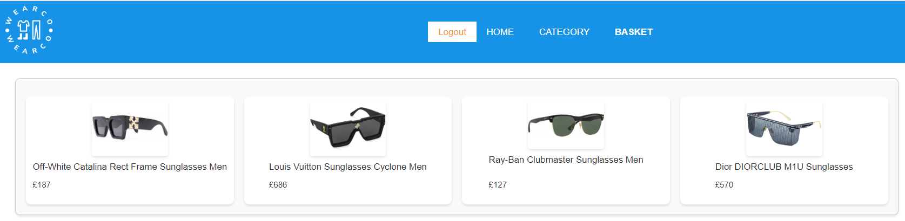

# WearCo 
  Welcome to the WearCo E-commerce Shop repository! This is an online store built by Chi, Diogo, and Haseeb, offering a wide range of trendy clothing and accessories. Whether you're looking for stylish T-shirts, comfortable shorts, fashionable sunglasses, or trendy shoes, WearCo has you covered.

## Features

- Browse through a diverse selection of T-shirts, shorts, sunglasses, and shoes in the homepage.
- View details about products including pictures, descriptions, and pricing.
- Have a category page to filter products of the same category.
- Add products to your shopping basket and proceed to a secure payment gateway.
- Responsiveness to different sizes of screens to maximize customers' experience.

## Technologies

- Express (for constructing server)
- Sequelize (for interacting with database)
- Handlebars (for creating html templates)
- Stripe (for building payment gateway)

## Table of Contents
  - [Installation](#installation)
  - [Database_setup](#database)
  - [Homepage](#homepage)
  - [Category](#category)
  - [Basket](#basket)
  - [Responsiveness](#responsiveness)
  - [Deployment](#deployment)

## Installation 
- Go to the WearCo [Link](https://github.com/cckinwest/Project2-WearCorp), click the button in the circle:
  
- Go to the empty directory, type the following command in the terminal:
  
- To set up the WearCo E-commerce Shop on your local machine, simply run the command 'npm i' in the terminal to install all necessary package.
  

## Database 
- Set up the database by first entering mysql by entering 'mysql -u root -p' and then the password:

- Enter 'source db/schema.sql' to set up the database.

- quit mysql, seed the data:

## Homepage
- On the first page of the application, we can browse all the items in the shop. 

- Before login/signup, some button is disabled. We need to login/signup first.

- After login/signup, the buy-now button is enabled.

- When clicking on the buy-now button, one item is ordered and put in the basket.

- By clicking on the link of product, you will get into the product page. You can click on the 'quantity' and 'Add to Basket' to make order.

## Category
- When you click on the category, the buttons for all categories are displayed.

- When clicking on each button, only the items of that category are displayed. You can also order item by clicking on the product page.

## Basket
- The basket page show all the orders made before processing. You can delete orders.

- When clicking checkout, you will get to a checkout page empowered by the Stripe.

- When the order is successfully processed, you will get to a page to enter address for delivery.

- After entering the address, you finally get to the confirmation to show the items ordered, delivery address, and email.

## Responsiveness
- Screen of large width (width > 1280px)

- Screen of large width (1280px > width > 960px)

- Screen of small width (960px > width)

## Deployment

Deployment of WearCo to heroku:
[WearCo's deployment](https://wearcorp-app-098bafb41b6f.herokuapp.com/)

Github of WearCo:
[WearCo's github](https://github.com/cckinwest/Project2-WearCorp.git)
